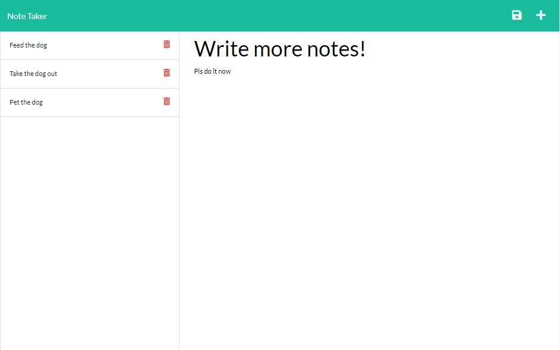

# note-taker_expressjs

## Table of Contents

* [Licensing](#licensing)
* [Installation](#installation)
* [Usage](#usage)
* [Contribution](#contribution)
* [Test](#test)
* [Questions](#questions)

## Licensing 

> note-taker_expressjs is protected and licensed under the [MIT](https://opensource.org/licenses/MIT) license.

## Description

This application uses express to create api routes to read and write to a JSON file used as a database for storing and pulling notes.
  
## Installation

Navigate to this application in terminal and run command 'npm install'

## Usage

This application has been deployed on heroku at https://note-taker-expressjs-vyang.herokuapp.com/

## Question

Please reach out to me at vyang1014888@gmail.com with any questions or issues.

You can find more of my work on my GitHub page at https://github.com/vyang14/.
